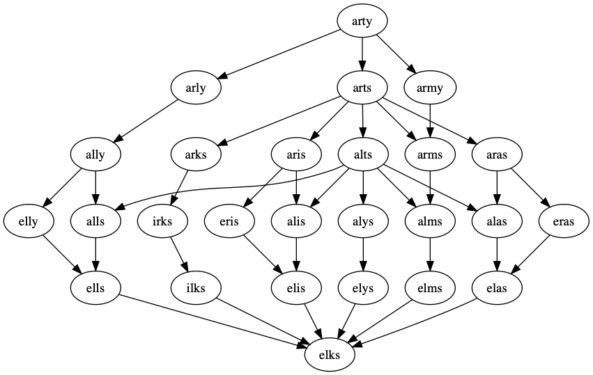

# Word Ladder

Find all solutions to a [word ladder](https://en.wikipedia.org/wiki/Word_ladder) puzzle using a graph.

A word ladder is a chain of words that link two words where each word in the chain only has one letter different to the adjacent words.

An example is shown below for "arty" and "elks".

The algorithm used builds a graph of the included wordlist, then finds all simple paths (i.e. paths with no cycles) between to words.
